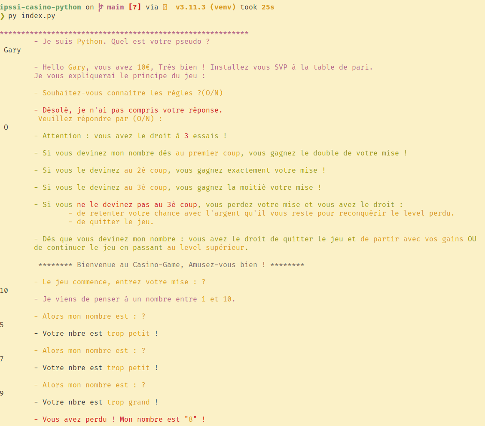

# About

> This is a student project

This is a little terminal-based game written in Python, that allows to guess a random number with three attempts and bet some money over it.

See picture for an illustration.

Stack :

- Python3
- SQLite
- Singleton DB connector
- No framework, all from scratch



# Equipe

- Brandon Soret
- Raid Guedoudj
- Sébastien Grivel
- Wissem Meridj
- Mouhamadou Soukouna
- Narcice Duval
- Vittorio Chillemi

# Choix techniques

- Architecture frontend - backend
- POO
- Single responsibility principle : une méthode = une action
- Encapuslation
- SQLite : BDD embarquée
- Modules

# Organisation

- Github : création de branches dédiées à la fonctionnalité, et ouverture de Pull Request sur `main`
- Relecture des PR par les pairs : 2 validation = on peut merger
- Trello : méthode Kanban en mode Sprint. 4 colonnes pour connaître l'état de chacune des tâches
- Assignation des  tâches à chacun en fonction des affinités et compétences

# Backend

## user API

Exemple pour créer user depuis `Game.py`

```
user = self.user_controller.createUser(user_name)
```

Exemple pour avoir l'user depuis `Game.py`

```
user = self.user_controller.getUserByName(user_name)
```

Exemples pour update user depuis `Game.py` :

```
self.connected_user.user_name = user_name_updated
self.connected_user.solde = 456
self.controller.updateUser(self.connected_user)
```


## stats API


Exemple pour insérer des stats  depuis Game.py :

```
stats_data = {
        'level': 1,
        'attempts': 2,
        'bet': 8,
        'profit': 5,
        'result': 1
}
new_stats = self.stats_controller.createStats(self.connected_user.user_id, stats_data)
```

Exemple pour get toutes les stats d'un user depuis Game.py :

```
allstats = self.stats_controller.getStatsByUser(self.connected_user.user_id)

for stat in allstats:
    print(stat.profit)
```

## singleton

Pour tester qu'il s'agit bien du même objet, dans DBConnection faire :

```
        c1 = DBConnector.Instance()
        c2 = DBConnector.Instance()

        print("Id of c1 : {}".format(str(id(c1))))
        print("Id of c2 : {}".format(str(id(c1))))

        print("c1 is c2 ? " + str(c1 is c2))
        sys.exit()

```

Ou bien dans DBConnection faire :

```
print("Id of Instance Connector : {}".format(str(id(cls.connector))))
```

# TODO

- Finaliser l'interface graphique
- Faire un classement entre joueurs
- Ajouter une BDD distante
- Faire de la data : stats, traitement, graphs, etc.

